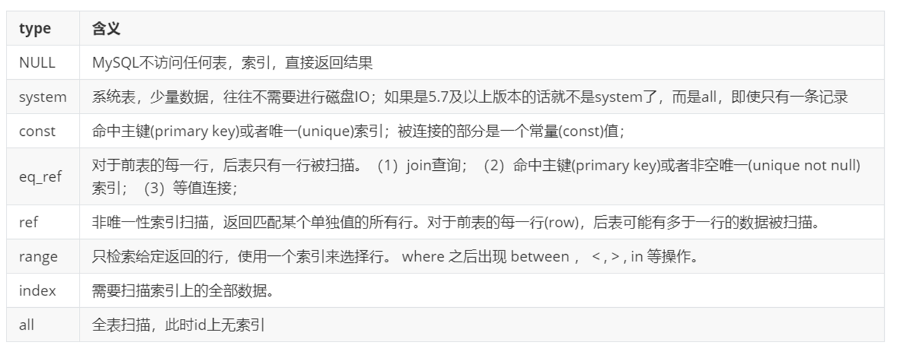

# mysql的优化

## 概念

在应用的的开发过程中，由于初期数据量小，开发人员写 SQL 语句时更重视功能上的实现，但是当应用系统正式上线后，随着生产数据量的急剧增长，很多 SQL 语句开始逐渐显露出性能问题，对生产的影响也越来越大，此时这些有问题的 SQL 语句就成为整个系统性能的瓶颈，因此我们必须要对它们进行优化.

MySQL的优化方式有很多，大致我们可以从以下几点来优化MySQL:

* 从设计上优化
* 从查询上优化
* 从索引上优化
* 从存储上优化

## 查看sql执行频率

MySQL 客户端连接成功后，通过 show \[session|global] status 命令可以查看服务器状态信息。通过查看状态信息可以查看对当前数据库的主要操作类型。

```sql
--下面的命令显示了当前 session 中所有统计参数的值
show session status like 'Com_______';  -- 查看当前会话统计结果
show global  status  like 'Com_______';  -- 查看自数据库上次启动至今统计结果
show status like 'Innodb_rows_%’;       -- 查看针对Innodb引擎的统计结果
```

.png>)

## 定位低效率执行SQL

可以通过以下两种方式定位执行效率较低的 SQL 语句。

1. 慢查询日志 : 通过慢查询日志定位那些执行效率较低的 SQL 语句。

```sql
-- 查看慢日志配置信息 
show variables like '%slow_query_log%’; 

-- 开启慢日志查询 
set global slow_query_log=1; 

-- 查看慢日志记录SQL的最低阈值时间 
show variables like 'long_query_time%’; 

-- 修改慢日志记录SQL的最低阈值时间 
set global long_query_time=4;

```

1. show processlist：该命令查看当前MySQL在进行的线程，包括线程的状态、是否锁表等，可以**实时**地查看 SQL 的执行情况，同时对一些锁表操作进行优化。

```
show processlist;
```

1. id列，用户登录mysql时，系统分配的"connection\_id"，可以使用函数connection\_id()查看
2. user列，显示当前用户。如果不是root，这个命令就只显示用户权限范围的sql语句
3. host列，显示这个语句是从哪个ip的哪个端口上发的，可以用来跟踪出现问题语句的用户
4. db列，显示这个进程目前连接的是哪个数据库
5. command列，显示当前连接的执行的命令，一般取值为休眠（sleep），查询（query），连接（connect）等
6. time列，显示这个状态持续的时间，单位是秒
7. state列，显示使用当前连接的sql语句的状态，很重要的列。state描述的是语句执行中的某一个状态。一个sql语句，以查询为例，可能需要经过copying to tmp table、sorting result、sending data等状态才可以完成
8. info列，显示这个sql语句，是判断问题语句的一个重要依据

## explain分析执行计划

通过以上步骤查询到效率低的 SQL 语句后，可以通过 EXPLAIN命令获取 MySQL如何执行 SELECT 语句的信息，包括在 SELECT 语句执行过程中表如何连接和连接的顺序。

示例：

```
explain select * from user where uid = 1;
```


